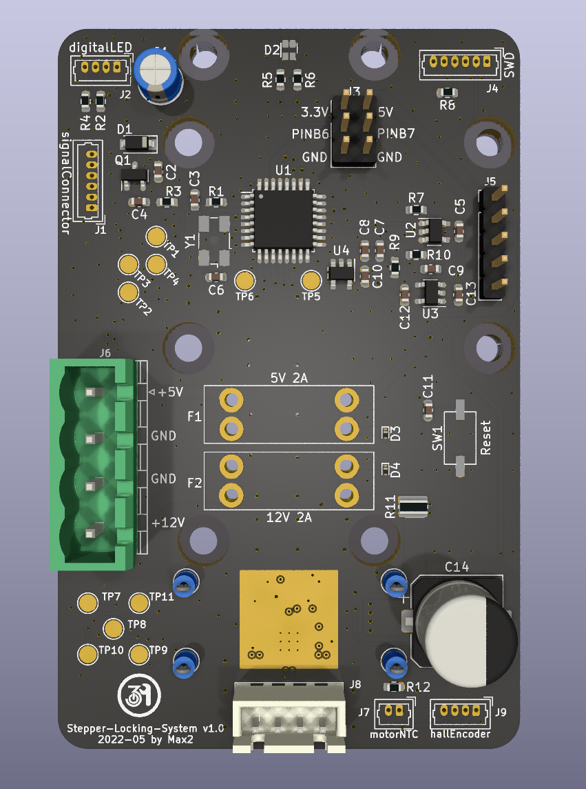
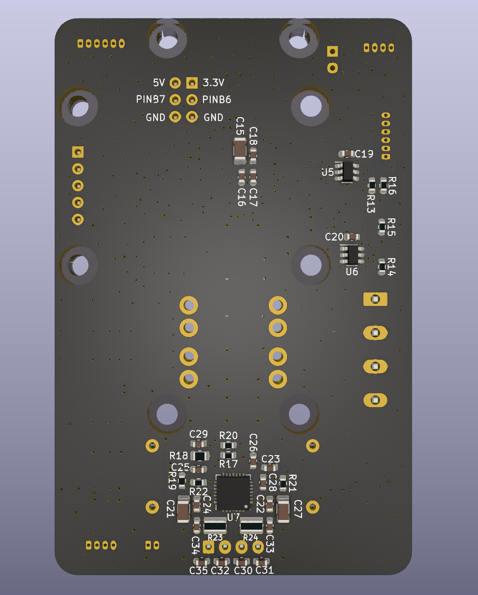

# Stepper Locking System

Steering the key/door knob with the might of stepper motors.
See the [Wiki](https://wiki.netz39.de/projects:2022:stepper_locking_system) (german) for more details and an overview.

## Firmware
The firmware written in C++ is [here](https://github.com/netz39/Stepper-Locking-System_firmware).

## Requirements for v1.0

* control stepper motor with Trinamic IC
* hall encoder connection to get current motor state
* read motor temperature
* CAN peripherie (dedicated PCB)
* power rails are secured by two fuses, with reverse polarity/overvoltage protection
* drive syncronous addressable LEDs
* get states from door and lock
* connection to two buttons to open/close door
* switch on/off Nerdstern (outdoor lamp)

## Known issues in v1.0
* Mosfet Q1 has wrong connections for choosen part. Gate and Source are swapped.
    * can be solved by simply solder the part upside down
* the LQFP32 package of STM32G0B1KE doesn't support HSE connection
    * the internal HSI is used

## Pictures (v1.0)

